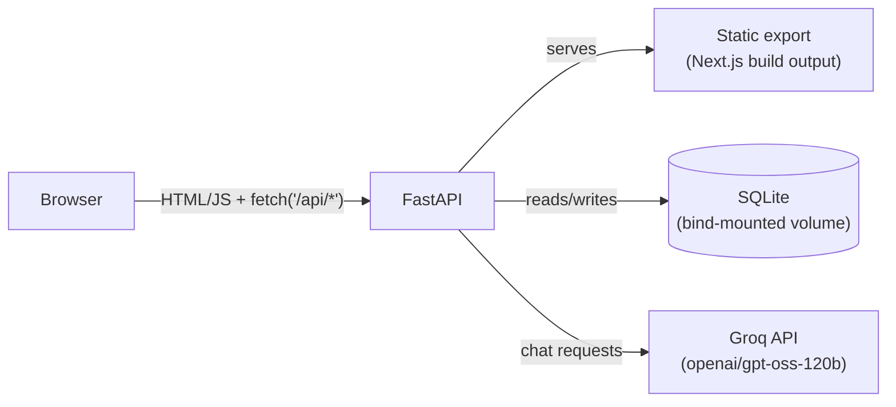

# Kanban Studio

A single-board Kanban app with an AI assistant. Sign in, organize work across
five fixed columns with drag and drop, and ask the built-in chat sidebar to
create, edit, move, or delete cards and rename columns for you. Everything
persists to a local SQLite database and runs as a single Docker container.

## Features

- Drag-and-drop Kanban board with five fixed, renameable columns
- Create, edit, move, and delete cards
- Session-based sign-in
- AI chat sidebar (Groq) that can read the board and make changes to it on
  request, with the board updating live
- Single Docker container; data persists across restarts via a bind-mounted
  volume

## Tech stack

**Frontend**
- [Next.js 16](https://nextjs.org/) (App Router, static export) with React 19
  and TypeScript
- [Tailwind CSS 4](https://tailwindcss.com/)
- [dnd-kit](https://dndkit.com/) for drag and drop
- [Vitest](https://vitest.dev/) + Testing Library (unit/component tests),
  [Playwright](https://playwright.dev/) (e2e tests)

**Backend**
- [FastAPI](https://fastapi.tiangolo.com/) on Python 3.12, managed with
  [uv](https://docs.astral.sh/uv/)
- SQLite via the stdlib `sqlite3` module (no ORM)
- [Groq](https://groq.com/) (`openai/gpt-oss-120b`) for the AI chat, using
  structured JSON-schema outputs so the model's replies map directly onto
  board operations
- [pytest](https://docs.pytest.org/) for backend tests

**Infrastructure**
- Docker (single multi-stage image serving both the API and the built
  frontend)

## Architecture

The frontend is built as a static export (plain HTML/CSS/JS, no Node server
at runtime) and served directly by FastAPI alongside its own JSON API. One
process, one container, one port.



- **Auth**: hardcoded single-user credentials; a successful login sets a
  signed, HTTP-only session cookie (HMAC, no server-side session store).
- **Data**: three tables (`users`, `board_columns`, `cards`) scoped by user
  id, so the schema already supports multiple users even though the MVP only
  exposes one. See [`docs/database.md`](docs/database.md) and
  [`docs/db-schema.json`](docs/db-schema.json).
- **AI chat**: each request sends the current board as JSON plus the
  conversation history to Groq, asking for a structured
  `{ reply, board_update }` response. A valid `board_update` is applied
  through the same functions the regular board API uses, then the fresh
  board is returned to the frontend — no separate "AI-only" code path.

## Getting started

**Prerequisites**: [Docker](https://www.docker.com/) and a
[Groq API key](https://console.groq.com/keys).

1. Clone the repository.
2. Create a `.env` file in the repo root:
   ```
   GROQ_API_KEY=your-key-here
   ```
3. Start the app:

   ```bash
   # macOS / Linux
   ./scripts/start.sh          # defaults to port 8000
   ./scripts/start.sh 8080     # or pick a port
   ```
   ```powershell
   # Windows
   .\scripts\start.ps1
   .\scripts\start.ps1 -Port 8080
   ```

4. Open `http://localhost:8000` and sign in with `user` / `password`.
5. Stop it with `./scripts/stop.sh` (or `.\scripts\stop.ps1` on Windows).

Board data lives in `./data/` (created automatically, git-ignored) and
survives restarts.

## Development

Running the frontend and backend directly (outside Docker) is useful for UI
iteration, but only Docker gives you the full stack talking to each other
end to end.

```bash
# Backend
cd backend
uv sync
uv run uvicorn backend.main:app --app-dir src --reload --port 8000

# Frontend (separate terminal, frontend-only — no backend calls will work)
cd frontend
npm install
npm run dev
```

## Testing

```bash
# Backend
cd backend && uv run pytest

# Frontend unit/component tests
cd frontend && npm run test:unit

# Frontend e2e tests (boots the real backend + static build automatically)
cd frontend && npm run test:e2e
```

## Project structure

```
backend/       FastAPI app, SQLite access, Groq integration, pytest suite
frontend/      Next.js app (static export), Vitest + Playwright suites
scripts/       start/stop scripts for Docker (Mac/Linux/Windows)
docs/          Project plan, database schema, and design docs
Dockerfile     Multi-stage build: Next.js static export + FastAPI backend
```

Each of `backend/CLAUDE.md` and `frontend/CLAUDE.md` documents its half of
the codebase in more depth; [`docs/PLAN.md`](docs/PLAN.md) has the full
build history and design decisions.
